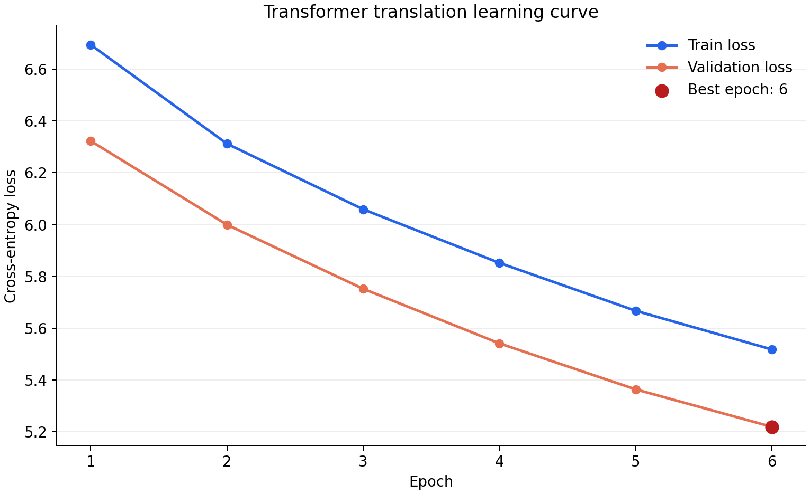

# Pytorch Transformer 实践


## 实验

`train.py` 是唯一训练入口，负责数据划分、分词器训练、模型训练、验证、测试和保存结果。`model.py` 实现 Transformer，`dataset.py` 构造模型输入，`config.py` 保存默认参数。

```powershell
python -c "import torch; print('torch', torch.__version__, 'cuda', torch.cuda.is_available())"
python -m pip install -r requirements.txt
python train.py --smoke-test
python download_data.py
```

`download_data.py` 从固定的 [OPUS Books en-it 版本](https://huggingface.co/datasets/Helsinki-NLP/opus_books)下载数据并核对 SHA256。若下载站点无法直连，可将本机已有的 `opus_books_en_it.parquet` 上传到项目目录后运行 `python download_data.py` 校验。训练时的 Hugging Face 缓存保存在项目内的 `.hf_cache/`，不会提交到 Git。

CPU 流程验证命令（512 条抽样句对，6 轮）：

```powershell
python train.py --run-dir runs/cpu-demo-512 --dataset-file opus_books_en_it.parquet --max-samples 512 --epochs 6 --batch-size 8 --seq-len 64 --d-model 64 --layers 1 --heads 8 --d-ff 128 --eval-samples 20 --seed 42
```

计划在租用的 GPU 上使用完整数据运行的命令；最终的 batch size 应按显存调整：

```powershell
python train.py --run-dir runs/full-gpu --dataset-file opus_books_en_it.parquet --epochs 20 --batch-size 16 --seq-len 128 --d-model 256 --layers 4 --heads 8 --d-ff 1024 --eval-samples 500 --seed 42
```

续训时保留相同的实验目录，`--epochs` 填目标总轮数，例如从 6 轮继续到 10 轮：

```powershell
python train.py --run-dir runs/cpu-demo-512 --resume --epochs 10
```

训练完成后，可输入句子查看最优权重的实际译文：

```powershell
python translate.py --run-dir runs/cpu-demo-512 --text "I love you."
```

### 实验产物与评估口径

每个 `runs/<实验名>/` 包含 `config.json`（训练参数）、`data_manifest.json`（数据 SHA256、划分数量、词表与软件版本）、`tokenizer_en.json`、`tokenizer_it.json`、`history.csv`、`loss_curve.png/svg`、`last.pt`、`best.pt`、`test_results.json` 和 `predictions.csv`。`runs/` 不提交到 Git；可展示的轻量结果可复制到 `examples/`，权重单独保存。

实验先按种子打乱，再抽样和划分为约 80%/10%/10%；分词器只在训练集上训练。每轮在验证集上计算损失，选择验证损失最低的权重，最后才在测试集评估。`test_loss` 覆盖过滤后的全部测试句；BLEU、CER、WER 使用 `--eval-samples` 指定数量的测试句（设为 `0` 则评估全部）。BLEU 越高越好，CER/WER 越低越好。实验使用贪心解码，译文和指标都由真实预测计算，不填入示例数字。

### CPU 演示实验

使用固定种子 42 和 512 条抽样句对，长度过滤后训练/验证/测试集分别有 370/49/49 条。6 轮的训练与验证损失均下降；20 条测试句的 BLEU 为 0，模型还没有学会有效翻译。这个结果仅用于证明实验流程、图表和评估文件可以复现。具体指标见 [CPU 演示测试结果](examples/cpu_demo_512/test_results.json)。



## Transformer 实现笔记

## Embedding + Positional Encoding

**涉及代码：**

`model.py`: 
- `class InputEmbeddings()`
- `class PositionalEncoding()`


$$
e^{-\ln(10000)\cdot \frac{2i}{d} } = \frac{1}{10000^{\frac{2i}{d}}}
$$

所以实际写代码算的是$LHS$那种形式，可以高效计算

```python
torch.exp(
  torch.arange(0, d_model, 2).float() * (-math.log(10000) / d_model)
)
```

## Layer Normalization

**涉及代码：**

`model.py`: 
- `class LayerNormalization()`


$$
y = \gamma \frac{x - \mu}{\sigma + \epsilon} + \beta
$$

```python
  def forward(self, x):
      mean = x.mean(dim=-1, keepdim=True) # -1表示最后一维，d_model维
      std = x.std(dim=-1, keepdim=True)
      return self.alpha * (x - mean) / (std + self.eps) + self.bias
```


## Feed-Forward Layer

**涉及代码：**

**涉及代码：**

`model.py`: 
- `class FeedForwardBlock()`

$$
FFN(x) = \max(0, xW_1 + b_1)W_2 + b_2
$$

```python
def forward(self, x):
    # (Batch, Seq_Len, d_model) --> (Batch, Seq_Len, d_ff) --> (Batch, Seq_Len, d_model)
    return self.linear_2(self.dropout(torch.relu(self.linear_1(x))))
```

## Multi-Head Attention

**涉及代码：**

`model.py`: 
- `class MultiHeadAttentionBlock()`


其中把$Q', K', V'$切成多头的操作：

```python
# (Batch, Seq_Len, d_model) --> (Batch, Seq_Len, h, d_k) --> (Batch, h, Seq_Len, d_k)
query = query.view(query.shape[0], query.shape[1], self.h, self.d_k).transpose(1, 2)
key = key.view(key.shape[0], key.shape[1], self.h, self.d_k).transpose(1, 2)
value = value.view(value.shape[0], value.shape[1], self.h, self.d_k).transpose(1, 2)
```

最后交换`dim 1`和`dim 2`是因为希望数据排列成：

```
- Batch 1
  - head 1
    - token 1
    - token 2
    - ...
  - head 2
    - ...
- ...
```

把不同头分成不同维度，然后矩阵乘法

### 计算注意力分数

$$
Attention(Q, K, V) = softmax(\frac{QK^\top}{\sqrt{d_{model}}}) V
$$


## Residual Connection

**涉及代码：**

`model.py`: 
- `class ResidualConnection()`


$$
output = x + Dropout(Sublayer(LayerNorm(x)))
$$

```python
return x + self.dropout(sublayer(self.norm(x)))
```

`sublayer`指的就是框起来的`Multi-Head Attetion`/`Feed Forward`


原始论文应该是先`sublayer`再`norm`的，实际反过来做也可以吧

## Encoder Block

**涉及代码：**

`model.py`: 
- `class EncoderBlock()`


- 1个多头注意力块
- 2个加和归一化
- 1个前馈神经网络

```python
def forward(self, x, src_mask):
    x = self.residual_connections[0](x, lambda x: self.self_attention_block(x, x, x, src_mask))
    x = self.residual_connections[1](x, self.feed_forward_block)
    return x
```

> lambda 参数列表: 返回表达式
>
> lambda 的作用：**包装成一个只接收单个参数的函数，把固定的 src_mask 捕获进去**

## 组装成 Encoder

```python
def forward(self, x, mask):
    for layer in self.layers:
        x = layer(x, mask)
    return self.norm(x)
```


## Decoder Block

```python
class Decoder(nn.Module):

    def __init__(self, layers: nn.ModuleList):
        super().__init__()
        self.layers = layers
        self.norm = LayerNormalization()

    def forward(self, x, encoder_output, src_mask, tgt_mask):
        for layer in self.layers:
            x = layer(x, encoder_output, src_mask, tgt_mask)
        return self.norm(x)
```

## Projection Layer(最后的线性层)

```python
def forward(self, x):
    # (Batch, Seq_Len, d_model) --> (Batch, Seq_Len, Vocab_Len)
    return self.proj(x)
```

`d_model` 维映射成 `vocab_size` 个原始分数，训练时交给 `CrossEntropyLoss`。


## Transformer

传入的参数：

- `encoder`: 编码器，多层 EncoderLayer + 最终 Norm
- `decoder`: 解码器，多层 DncoderLayer + 最终 Norm
- `src_embed`: 把 token 映射为 d_model 维向量
- `tgt_embed`: 解码器端的词嵌入
- `src_pos`: 给嵌入加位置信息
- `tgt_pos`: 解码器端的位置编码
- `projection_layer`: 把隐藏特征映射到词表概率

把所有 `Transformer` 所需要的组件都包装在一个类里

## Build Transformer 设置 `Transformer` 中用到的超参数

```python
def build_transformer(src_vocab_size: int, tgt_vocab_size: int, 
                      src_seq_len: int, tgt_seq_len: int, 
                      d_model: int=512, N: int=6, h: int=8, 
                      dropout: float=0.1, d_ff: int=2048) -> Transformer:
```

- `N`: 重复的层数

## 构建训练代码


> 准备数据、分词器


### Tokenizer

涉及代码：

- `train.py`


## 把数据（双语文本）转换成 Transformer 可以训练的格式

转换数据的工具会在 `train.py` 中使用

一般继承 `Dataset` 类数据就能被 `DataLoader` 批量读取

数据格式：

```
[
 {
  "translation":{
      "en":"I love you",
      "it":"Ti amo"
  }
 }
]
```

`Dataset` 的作用就是把他转换成：

```
encoder_input:
[101, 23, 56, 89, 102, 0,0,0]

decoder_input:
[101, 77, 88, 99,0,0,0]

label:
[77,88,99,102,0,0,0]
```

的形式

### class BilingualDataset

```python
def __init__(
    self,
    ds,               # 原始数据
    tokenizer_src,    # 源语言 tokenizer
    tokenizer_tgt,    # 目标语言 tokenizer
    src_lang,         # 源语言 en
    tgt_lang,         # 目标语言 it
    seq_len           # 句子最大长度
):
```

## Config 配置训练任务

涉及代码：

- `config.py`

```python
def get_config():
    return {
        "dataset_file": None,
        "max_samples": None,
        "epochs": 20,
        "batch_size": 16,
        "seq_len": 128,
        "d_model": 256,
        "layers": 4,
        "heads": 8,
        "d_ff": 1024,
        "lr": 1e-4,
        "seed": 42,
        "eval_samples": 100,
    }
```
